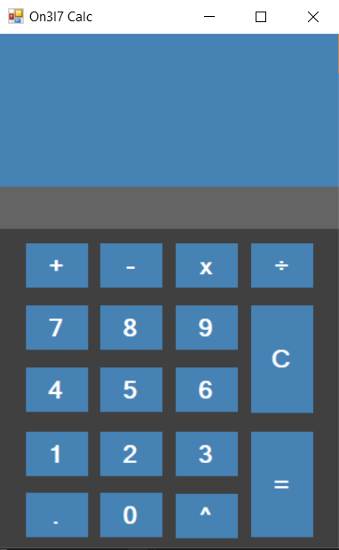

# On3l7 Calc C#

---

Hey guys! What's up? this is my project of a simple calculator with C#, enjoy, 

###### Functionality:

- Do the four basics operations.

- Simple Design.

- Easy to use.

- Have empowerment.

###### Designed By:

>    On3l7d15
